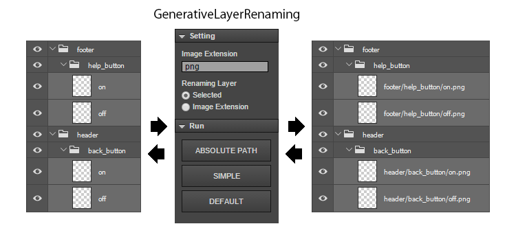
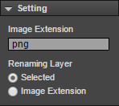
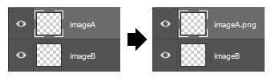
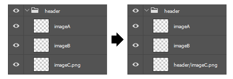
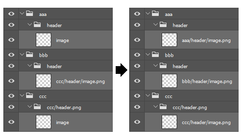
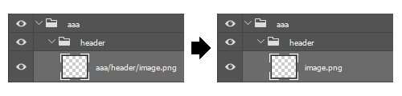
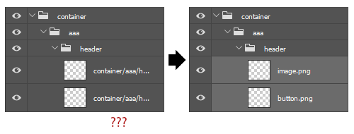
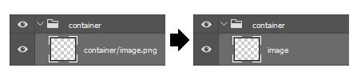

# GenerativeLayerRenaming
=======================

Document Language [English] | [[Japanese](README_jp.md)]

GenerativeLayerRenaming is a extension panel for Photoshop CC.
Image extension setting to a layer can be simplified for Photoshop Generating Image Assets.

---
## Download

In the case of Windows, it can save from a right-click.

### zxp file (for Photoshop CC)

* [GenerativeLayerRenaming.zxp](https://raw.github.com/siratama/GenerativeLayerRenaming/master/download/GenerativeLayerRenaming.zxp)

This file is a extension panel for Photoshop CC.
[Extension Manager Command Line tool(ExManCmd)](https://www.adobeexchange.com/resources/28) is required in order to install. 

### jsx file (for Photoshop Any Version)

* [ToAbsolutePathInSelectedLayer.jsx](https://raw.github.com/siratama/GenerativeLayerRenaming/master/download/ToAbsolutePathInSelectedLayer.jsx)
* [ToAbsolutePathInImageExtensionLayer.jsx](https://raw.github.com/siratama/GenerativeLayerRenaming/master/download/ToAbsolutePathInImageExtensionLayer.jsx)

A jsx file supports only png and a absolute path.

---
## Setting

### Image Extension

A image extension to a layer name is set. For example png, jpg, and gif.

### Renaming Layer

The type of the layer to process it is set.

#### Selected

Only a selected layer is a target.

#### Image Extension

Only a layer with the image extension set by 'Image Extension' is a target.

---
## Run 

### ABSOLUTE PATH

It's changed to an image extension layer of a absolute path.

### SIMPLE

It's changed to a simple image extension layer.

Appearance will be better.

However, when using this function, be careful because the image of unintended folder configuration is output.

### DEFAULT

It's returned to a default layer name.

---
## Deficient function 

Image asset generation of Photoshop, you can be fine setting to the layer name.

[Photoshop Help/Generate image assets from layers](https://helpx.adobe.com/photoshop/using/generate-assets-layers.html)

In my extension, it can not respond to all the settings.

---
## notice

In our extension, it will examine whether there is an "." or "/" to the layer name.
If these characters is in the default layer name, it does not work properly.

