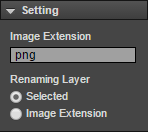
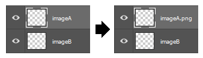
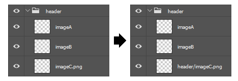
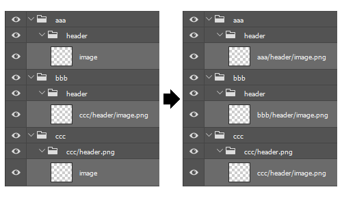
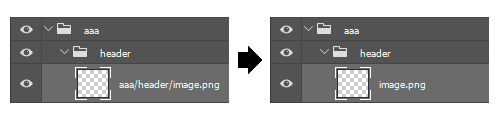

# GenerativeLayerRenaming
=======================

Document Language [[English](README.md)] | [Japanese]

GenerativeLayerRenaming は Photoshop CC 用拡張パネルです。
Photoshop 自動画像アセット生成機能用に、レイヤーへの画像拡張子設定を簡略化できます。

---
## ダウンロード

Windows の場合、右クリックから「リンク先のコンテンツを保存」を選択で保存できます。

### zxp file (for Photoshop CC)

* [GenerativeLayerRenaming.zxp](https://raw.github.com/siratama/GenerativeLayerRenaming/master/download/GenerativeLayerRenaming.zxp)

Photoshop CC 拡張パネル用ファイルです。
インストールには別途 [Extension Manager Command Line tool(ExManCmd)](https://www.adobeexchange.com/resources/28)が必要です。

### jsx file (for Photoshop Any Version)

* [ToAbsolutePathInSelectedLayer.jsx](https://raw.github.com/siratama/GenerativeLayerRenaming/master/download/ToAbsolutePathInSelectedLayer.jsx)
* [ToAbsolutePathInImageExtensionLayer.jsx](https://raw.github.com/siratama/GenerativeLayerRenaming/master/download/ToAbsolutePathInImageExtensionLayer.jsx)

これら jsx ファイルは 拡張子 png の絶対パス設定のみのサポートとなります。

---
## Setting 設定

### Image Extension

レイヤー名に設定する画像拡張子を文字列で指定します。png, jpg, gif といった任意の拡張子の設定が可能です。

### Renaming Layer

処理対象とするレイヤーの種別を設定します。

#### Selected

選択されたレイヤーのみが処理対象となります。

#### Image Extension

Image Extension で設定した画像拡張子が記述されているレイヤーのみが自動的に処理対象となります。

---
## Run 処理実行

### ABSOLUTE PATH

対象レイヤーを絶対パスの拡張子レイヤーに変更します。

内部のフォルダ構成を変更した場合や、フォルダ自体に画像拡張子設定がされている場合でも、問題なく変換します。

### SIMPLE

対象レイヤーを絶対パス無しの拡張子レイヤーに変更します。

絶対パス拡張子レイヤーにすると、とてもレイヤー名が長くなり見通しが悪くなってしまうことがあります。
デザイン中はどこにどのレイヤーがあるのか判別しやすくしたい、という場合用に SIMPLE 変換機能を用意しました。

ただしこの機能を利用した状態で自動画像アセット生成機能が実行されると、
意図しないフォルダ構造で画像出力が行われてしまうためご注意ください。

### DEFAULT

対象レイヤーを、絶対パスも拡張子も無いレイヤーに変更します。

---
## サポートしていない機能

Photoshop の自動画像アセット生成機能は、レイヤーに対し細かい指定を行うことで様々なフォーマットへの出力が可能となります。

[Photoshop ヘルプ/レイヤーからの画像アセットの生成](https://helpx.adobe.com/jp/photoshop/using/generate-assets-layers.html)

当拡張機能では「レイヤーへの拡張子付け」と、psd 内フォルダ構成のパスをレイヤーに付与する機能のみのサポートしています。

---
## 注意点

当拡張機能では、レイヤー名に「.」「/」の文字があるかどうかで、レイヤー名の変換を行っています。
これら文字がデフォルトのレイヤー名にある場合、意図通り動作しなくなるためご注意ください。

